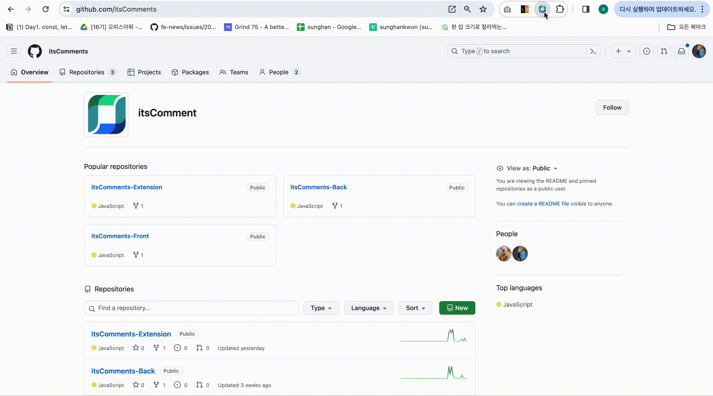
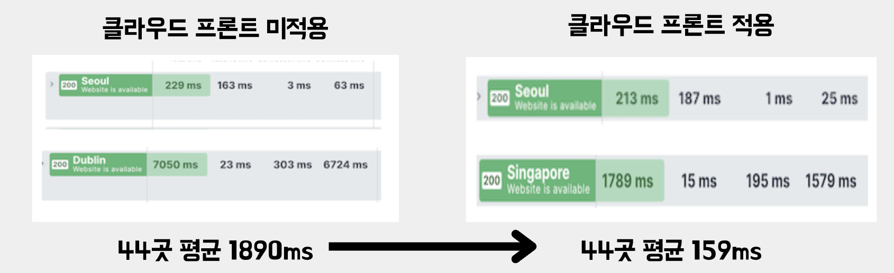
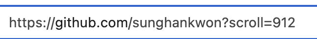
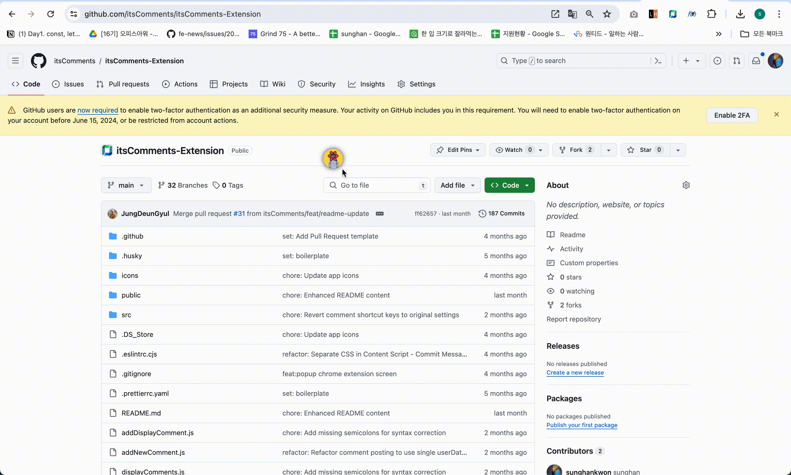
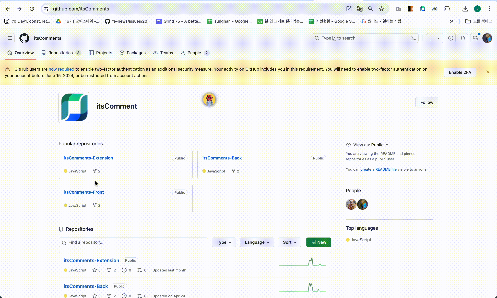

# its Comments

<p align="center">
  
</p>

### 어디에서든 댓글을 작성하고 해당 댓글을 손쉽게 공유할 수 있는 크롬 익스텐션 서비스 입니다.

## **🔗 Link**

- [its Comments 웹스토어](https://chromewebstore.google.com/detail/its-comments/ajfkielhcpmnblcimkmmmglapjkhfehf?hl=ko)

- [크롬익스텐션 레포](https://github.com/sunghankwon/itsComments-Extension)

- [클라이언트 레포](https://github.com/sunghankwon/itsComments-Front)

- [서버 레포](https://github.com/sunghankwon/itsComments-Back)

<br></br>

# 📕 Contents

- [💪 Motivation](#💪-motivation)
- [🛠 Tech Stacks](#🛠-tech-stacks)
  1. [왜 크롬익스텐션으로 개발하였는가?](#왜-크롬익스텐션으로-개발하였는가)
  2. [크롬 익스텐션은 어떻게 동작하는가?](#크롬-익스텐션은-어떻게-동작하지)
  3. [왜 React로 개발하였는가?](#왜-리액트로-개발하였는가)
  4. [왜 SSE를 사용했는지](#왜-sseserver-sent-events를-사용했는가)
  - 1 [연결 및 해제 비용](#1-연결-및-해제-비용)
  - 2 [배터리 소모량](#2-배터리-소모량)
  - 3 [Chrome 익스텐션 환경](#3-chrome-익스텐션-환경)
- [💾 Features](#💾-features)
- [🤫 Pain point](#🤫-pain-point)
  1. [비회원 댓글을 한시간 뒤에 어떻게 삭제할까?](#1-비회원-댓글을-한시간-뒤에-어떻게-삭제할까)
  - [UseQuery를 사용한 클라이언트 측 자동 삭제](#1-usequery를-사용한-클라이언트-측-자동-삭제)
  - [서버 측 Cron 작업을 이용한 삭제](#2-서버-측-cron-작업을-이용한-삭제)
  - [MongoDB의 TTL(Time-To-Live) 기능을 활용한 자동 삭제](#3-mongodb의-ttltime-to-live-기능을-활용한-자동-삭제)
  2. [이미지를 어떻게 처리해 줄까?](#2-이미지를-어떻게-처리해-줄까)
  - [Base64를 사용하여 인코딩](#2-1-base64로-인코딩후-해당-인코딩-값을-db에-저장)
  - [S3를 연동하여 이미지 저장](#2-2-s3에-이미지를-저장하고-해당-이미지-주소를-db에-저장)
  - [CloudFront 적용](#2-3-cloudfront-적용하여-로딩-시간-단축)
  - [비회원 댓글 삭제 방식 결정](#비회원-댓글-자동-삭제-방식-결정)
  3. [url로 이동시 어떻게 댓글이 작성된 위치로 이동해줄까?](#3-url로-이동시-어떻게-댓글이-작성된-위치로-이동해줄수있을까)
- [📑 Challenges](#📑-challenges)
  1. [일관 되지 않은 스타일을 어떻게 처리할까?](#1-일관-되지-않은-스타일을-어떻게-처리할까)
  - [해결방법: Shadow DOM 적용](#해결방법-shadow-dom-적용)
  - [Shadow DOM의 closed 속성](#shadow-dom의-closed-속성)
  2. [페이지에 작성한 댓글은 어떻게 유지해야할까?](#2-어떻게-댓글을-페이지에-유지시킬수-있을까)
  - [해결방법1: 댓글의 정보를 저장하고 페이지 로드시마다 댓글 작성](#2-1-해결방법1-댓글의-정보를-댓글에-저장하고-페이지-이동시-새로-작성)
  - [해결방법2: windowhisory를 사용하여 SPA에서 URL 변경 감지](#2-2-해결방법2-windowhistory를-이용하여-싱글-페이지-애플리케이션에서-url-변경-감지)
- [👨🏻‍🏫 Memoir](#👨🏻‍🏫-memoir)

<br></br>

# **💪 Motivation**

일상적인 작업이나 학습 활동 중에 발생하는 정보 전달 과정은 번거로운 과정을 거치고 있습니다. 특히, 특정 페이지나 내용을 다른 사람에게 전달하거나 협업 시 특정 부분에 대한 수정 요청을 할 때, 현재의 플로우는 다음과 같은 번거로운 작업들로 이뤄져 있습니다.

1. **링크 복사 및 스크린샷/내용 저장:**
   - 특정 페이지의 링크를 복사하고, 해당 페이지의 특정 부분에 대한 스크린샷을 찍거나 내용을 복사하여 저장합니다.
2. **메일이나 메신저로 전달:**
   - 저장한 정보를 이메일이나 메신저를 통해 상대방에게 전달합니다.
3. **수정 요청 시 스크린샷 및 정리:**
   - 협업 시, 특정 부분에 대한 수정을 요청할 때는 해당 부분의 스크린샷을 찍고 수정이 필요한 내용을 정리하여 다시 전달합니다.

저희는 이러한 번거로운 작업들을 간소화하고자, 이 프로젝트를 기획하게 되었습니다.

<br></br>

# **🛠 Tech Stacks**

## Extension


## Client


## SERVER


## TEST


## Deployment


## 왜 크롬익스텐션으로 개발하였는가?

Chrome 확장 프로그램의 가장 큰 장점은 어떤 작업을 수행하기 위해 한 플랫폼에서 다른 플랫폼으로 전환할 필요가 없다는 것입니다. 언제든 이러한 확장 프로그램에 액세스할 수 있습니다.

또한 Google Chrome 앱만 있으면 모든 PC, Mac 또는 Windows에서 확장 프로그램을 사용할 수 있으므로 누구나 액세스할 수 있습니다.

<br />

## 크롬 익스텐션은 어떻게 동작하지?


### popup.html

- 익스텐션의 팝업 창을 정의합니다. 보통 사용자가 익스텐션 아이콘을 클릭하면 나타나는 작은 창이며, 여기에 사용자 인터페이스 요소를 배치할 수 있습니다.
- HTML과 CSS를 사용하여 팝업 창의 레이아웃과 스타일을 설계합니다.
- 사용자와의 상호작용을 위한 버튼, 입력 필드 등을 포함할 수 있습니다.
- 일반적으로 팝업 창은 사용자가 짧은 작업을 수행하거나 익스텐션의 설정을 변경할 수 있는 기능을 제공합니다.

### background.js

- 백그라운드 스크립트는 익스텐션의 수명 주기 동안 실행되는 JavaScript 코드를 포함합니다.
- 주로 익스텐션의 전역적인 상태 관리, 이벤트 처리, 백그라운드 작업 처리 등을 담당합니다.
- 익스텐션이 설치되면 백그라운드 스크립트가 자동으로 실행되며, 익스텐션의 핵심 로직을 구현합니다.
- 백그라운드 스크립트는 주로 브라우저 이벤트를 감지하고, 이벤트에 대응하여 알맞은 동작을 수행합니다.

### contentscript.js

- 웹 페이지의 컨텐츠에 대한 조작이나 수정을 담당합니다.
- 익스텐션에서 특정 웹페이지를 대상으로 동작해야 할 때 사용됩니다.
- 유일하게 웹 페이지의 DOM 요소를 조작하거나 이벤트를 감지하여 동적으로 웹 페이지의 내용을 변경할 수 있습니다.
- 주로 웹 페이지와의 상호작용이 필요한 경우에 사용됩니다.

<br />

## 왜 리액트로 개발하였는가?

리액트는 컴포넌트 기반 아키텍처를 통해 UI를 재사용 가능한 모듈로 분리하여 개발할 수 있게 합니다. 이는 여러 측면에서 이점을 제공하며, 특히 피드나 클라이언트 페이지에 표시되는 댓글들을 하나의 컴포넌트로 재사용하기 용이합니다. 이러한 구조는 유지보수와 확장을 용이하게 하고, 코드의 일관성을 유지하는 데 도움이 됩니다.

**컴포넌트 재사용성**<br />
리액트는 UI 요소를 독립적인 컴포넌트로 분리하여 재사용할 수 있습니다. 예를 들어, 피드와 클라이언트 페이지에서 동일한 댓글 컴포넌트를 사용하여 중복된 코드를 방지할 수 있습니다. 리액트의 컴포넌트 기반 아키텍처는 이러한 재사용성을 극대화하여 개발 효율성을 높이고, 유지보수를 용이하게 합니다.

반면, 바닐라 자바스크립트에서는 UI 요소를 재사용 가능한 컴포넌트로 나누기가 어렵습니다. 피드와 클라이언트 페이지에서 동일한 댓글 UI를 사용하려면, 각 페이지마다 중복된 코드를 작성해야 합니다. 이는 코드의 중복을 초래하며, 유지보수가 어려워지고, 새로운 기능을 추가하거나 기존 기능을 수정할 때 오류가 발생할 가능성이 높아집니다.

**유지보수 용이성**<br />
리액트는 컴포넌트 단위로 코드를 관리하기 때문에, 코드의 일관성을 유지하면서도 수정 및 업데이트가 용이합니다. 예를 들어, 댓글 컴포넌트의 스타일을 변경할 때, 한 곳에서 수정하면 모든 사용 사례에 반영됩니다. 이는 코드의 가독성을 높이고, 버그를 줄이며, 개발 속도를 향상시킵니다.

반면, 바닐라 자바스크립트로 작성된 코드베이스는 구조화가 부족하여, 코드가 복잡해질수록 유지보수가 어려워집니다. 댓글 UI의 스타일을 변경하려면 여러 파일을 찾아서 일일이 수정해야 할 수 있습니다. 이는 실수의 가능성을 높이고, 유지보수 비용을 증가시킵니다.

**확장성**<br />
리액트의 컴포넌트 구조는 새로운 기능을 추가할 때 기존 컴포넌트를 재사용하거나, 최소한의 수정만으로 기능을 확장할 수 있게 합니다. 예를 들어, 댓글 컴포넌트에 좋아요 기능을 추가할 때, 기존 컴포넌트를 약간만 수정하여 구현할 수 있습니다. 이는 개발 효율성을 높이고, 코드의 일관성을 유지하는 데 도움이 됩니다.

반면, 바닐라 자바스크립트에서는 새로운 기능을 추가할 때 기존 코드를 많이 수정해야 하며, 이로 인해 예기치 않은 오류가 발생할 수 있습니다. 댓글에 좋아요 기능을 추가하려면, 기존 댓글 렌더링 로직을 모두 수정해야 할 수 있습니다. 이는 개발 속도를 저하시킬 뿐만 아니라, 코드의 일관성을 유지하기 어렵게 만듭니다.

위와 같은 이유들로 React를 사용하여 프로젝트를 효율적으로 개발을 진행하였습니다.

<br />

## 왜 SSE(Server-Sent-Events)를 사용했는가?


저희는 프로젝트 초기에는 webSocket를 사용하여 프로젝트를 진행하려고 하였습니다.

하지만 프로젝트를 진행하면서 자주 변경되지 않는 댓글이나, 태그된 인원에게 알람을 주는 일을 SSE보다 비용이 많이 드는 webSocket을 사용할 필요는 없다고 생각이 들게 되었습니다 websocket과 SSE를 비교하여 저희 프로젝트에 유리한 3가지의 이유로 SSE를 선택하게되었습니다.

### 1. 연결 및 해제 비용

WebSocket과 SSE는 모두 실시간 통신을 가능하게 합니다. 그러나 WebSocket은 양방향 통신을 지원하기 때문에 연결 및 해제 과정에서 추가 비용이 발생합니다. 반면 SSE는 HTTP 연결을 통해 단방향 통신을 제공하므로, 각 이벤트 스트림은 독립적으로 유지됩니다. 이는 새로운 연결을 맺거나 끊는 과정에서 소켓에 비해 더 적은 오버헤드를 발생시킵니다. 프로젝트에서는 자주 변경되지 않는 정보를 전송하는 경우가 많아 SSE가 효율적인 선택이 되었습니다.

### 2. 배터리 소모량

WebSocket은 백그라운드에서 지속적으로 활성화된 상태를 유지해야 하므로 배터리 소모량이 증가합니다. 반면 SSE는 한 번 연결된 후 서버에서 이벤트가 발생할 때까지 기다리는 방식이므로 네트워크 사용량이 적어 배터리 소모량이 적습니다. 특히 Chrome 익스텐션 환경에서는 배터리 소모량을 최소화하는 것이 중요하므로 SSE가 더 적합한 방법이라고 생각하였습니다.

### 3. Chrome 익스텐션 환경

Chrome 익스텐션에서는 백그라운드 페이지와 팝업 페이지가 서로 다른 환경에서 실행됩니다. 이러한 보안상의 이유로 백그라운드 페이지에서는 다른 파일을 직접 import 할 수 없습니다. SSE는 HTTP를 기반으로 하기 때문에 이러한 제약을 우회할 수 있습니다. 따라서 보안상의 이유로 인해 직접 파일 import가 허용되지 않는 Chrome 익스텐션 환경에서도 SSE를 원활하게 사용할 수 있습니다.

이렇게 SSE를 선택함으로써 프로젝트의 효율성을 높이고, 성능을 최적화할 수 있었습니다.

<br /><br />

# **💾 Features**

### 댓글 작성

- 사용자는 원하는 위치에 댓글을 작성할 수 있습니다.
- 댓글은 팝업의 버튼과 단축키(Alt/Option + D)를 이용해서 활성화 시킬수 있습니다.
- 활성화 시 마우스 커서에 검정 원이 추가되고 클릭시 해당 위치에 댓글 작성 모달이 생성됩니다.

<details>
<summary>댓글작성 영상</summary>

</details>

### 댓글 공유

- 사용자는 작성하는 댓글을 다른 사람과 공유할 수 있습니다.
- 사용자는 댓글입력창에 @를 입력하면 친구목록 드롭다운 버튼 표시
- 공유할 친구를 선택시 해당 친구에게 댓글을 공유할 수 있습니다.
- 메일입력창에 공유하고자 하는 메일주소를 작성하여 메일을 통해 공유할 수 있다.
- 해당 댓글 작성시 공개 비공개를 선택 할 수 있다.
- 공개 댓글의 경우 익스텐션을 설치한 모든 유저가 확인 가능
- 비공개 댓글의 경우 작성자 본인과 공유된 사용자만 확인 가능

<details>
<summary>댓글공유 영상</summary>

</details>

### 댓글 표시

- 댓글 작성시 해당 위치에 작성자의 프로필 아이콘이 해당 위치에 표시가 됩니다.
- 해당 아이콘에 마우스를 가져가면 댓글 작성자, 댓글내용, 댓글 상세페이지로 이동 버튼이 표시가 됩니다.

<details>
<summary>댓글작성완료 영상</summary>

</details>

### 댓글 활성화

- 토글을 활성화하면 해당 페이지에 작성된 댓글이 표시됩니다.
- 토글을 비활성화하면 해당 페이지에 작성된 댓글이 숨겨집니다.

<details>
<summary>댓글활성화 토글 영상</summary>

</details>

## 클라이언트 페이지

### 대시보드

- My Comments 클릭시 사용자가 작성한 댓글을 표시됩니다.
- Received Comments 클릭시 사용자가 태그된 댓글을 표시됩니다.

### 싱글뷰

- 좌측에 댓글의 작성자, 내용, 스크린샷과 댓글 상세페이지로 이동, url로 이동 버튼이 표시
- 우측에 사용자가 작성한 댓글, 사용자가 태그된 댓글을 최신순으로 표기
- 클릭시 좌측 댓글 변경

### 친구

- 친구 목록이 표시됩니다.
- 친구를 추가하고 삭제할수있습니다.

### 댓글 상세 페이지

- 좌측에 해당 댓글에 스크린샷 표시됩니다.
- 우측에 해당 댓글의 정보가 표시됩니다.
- reply 클릭시 답글을 작성할 수 있습니다.

### 댓글 수정

- 댓글 상세페이지 이동시 댓글 작성자의 경우 댓글 수정버튼(🖊️)이 표시
- 해당 버튼 클릭시 댓글 수정이 가능한 텍스트에어리어로 변경
- 수정 버튼 클릭시 해당 댓글 내용 수정
- 취소 버튼 클릭시 기존 댓글 유지

### 댓글 삭제

- 댓글 상세페이지 이동시 댓글 작성자의 경우 댓글 삭제버튼(🗑️)이 표시
- 해당 버튼 클릭시 삭제 확인 모달 표시
- 삭제 버튼 클릭시 해당 댓글 삭제

<br /><br />

# **🤫 Pain point**

## 1. 비회원 댓글을 한시간 뒤에 어떻게 삭제할까?

이번 프로젝트 진행 과정에서, 사용자 경험 향상을 위한 한 가지 중요한 결정으로, 익스텐션이 설치된 경우 비회원 사용자도 댓글을 작성할 수 있게 하였습니다. 이는 접근성을 높이고 사용자 참여를 촉진하기 위한 조치였습니다.

하지만, 비회원 사용자가 댓글을 작성할 수 있게 되면서 동시에 무분별한 댓글 작성의 가능성이 증가했습니다. 이러한 문제를 해결하고자, 비회원 사용자가 작성한 댓글은 1시간 후에 자동으로 삭제되는 기능을 도입하기로 결정하였습니다. 이 기능은 댓글의 질을 유지하고, 서비스 관리에 있어서도 효율성을 제공할 것입니다.

이를 구현하기 위해, 다음 세 가지 방법을 고려하게 되었습니다.

<br />

### **1. UseQuery를 사용한 클라이언트 측 자동 삭제**

UseQuery는 리액트 쿼리 라이브러리의 일부로, 클라이언트 측에서 특정 작업을 주기적으로 실행할 수 있는 폴링(polling) 기능을 제공하고 있습니다. 이를 이용해, 한 시간 간격으로 데이터 삭제 요청을 자동으로 수행할 수 있습니다.

<br />

> **UseQuery 사용시 장점**
>
> 해당 방법은 클라이언트 측에서 실시간으로 댓글 삭제를 확인하고 반영할 수 있어 사용자 경험이 즉각적이고 비교적 간단하게 구현할 수 있다는 장점이 있습니다.
>
> **UseQuery 사용시 단점**
>
> 이 방법을 사용하기 위해서는 먼저 리액트 쿼리 라이브러리를 추가로 설치해야 하고 또한 이 접근 방식은 클라이언트가 종료되었을 때 삭제 작업이 수행되지 않는다는 단점이 존재하였습니다.

<br />

### **2. 서버 측 Cron 작업을 이용한 삭제**

서버 측에서 Cron 작업을 스케줄링하여 데이터 삭제를 자동으로 진행하는 방법입니다. 이 방식은 서버가 실행 중일 때 정기적으로 데이터를 삭제할 수 있게 해 줍니다.

<br />

> **Cron 사용시 장점**
>
> 해당 방법의 경우 서버에서 주도적으로 댓글 삭제를 관리하므로 클라이언트의 상태와 무관하게 작업이 실행 될 수있고, Cron 작업을 통해 다양한 시간 간격으로 작업을 스케줄링할 수 있는 장점이 있습니다.
>
> **Cron 사용시 단점**
>
> 이 방법의 경우 서버가 종료되었을 경우, 예정된 삭제 작업이 실행되지 않는 단점이 있었습니다.

<br />

### **3. MongoDB의 TTL(Time-To-Live) 기능을 활용한 자동 삭제**

MongoDB의 TTL 기능을 이용하는 방법은 데이터베이스 자체에서 데이터 삭제를 자동으로 관리할 수 있게 해 줍니다. 댓글이 생성될 때, 해당 댓글의 생명 주기를 1시간으로 설정하고 이 정보를 데이터베이스에 저장합니다. TTL 기능은 설정된 생명 주기가 지나면 자동으로 데이터를 삭제합니다.

```jsx
commentSchema.pre("save", async function (next) {
  if (this.creator.toString() === process.env.NON_MEMBER) {
    this.expiresAt = new Date(Date.now() + 60 * 60 * 1000);
  }

  next();
});
```

> **MongoDB TTL 기능 사용시의 장점**
>
> 이 방식의 가장 큰 장점은 클라이언트나 서버의 실행 여부와 상관없이 데이터베이스가 자체적으로 데이터를 관리하고 삭제할 수 있다는 것입니다.
>
> **MongoDB TTL 기능 사용시의 단점**
>
> MongoDB의 TTL 인덱스는 백그라운드에서 주기적으로 컬렉션을 스캔하여 만료된 문서를 삭제하는데, 이 스캔 주기는 기본적으로 60초마다 한 번씩 실행됩니다. 따라서 TTL로 설정한 시간이 지나더라도, 다음 스캔 주기가 도래하기 전까지는 해당 문서가 삭제되지 않을 수 있습니다. 이 경우, TTL을 1시간으로 설정했을 경우, 정확히 1시간 후가 아니라 최대 1시간 1분 후에 삭제될 수 있어서 제가 원하는 시간에 정확하게 삭제가 되지 않을 수 있는 단점이 있습니다.

### **비회원 댓글 자동 삭제 방식 결정**

장단점을 비교한 결과, 클라이언트나 서버의 실행 상태와 무관하게 데이터베이스 자체적으로 비회원 댓글을 자동으로 관리하고 삭제할 수 있는 MongoDB의 Time-To-Live(TTL) 기능을 선택하였습니다.<br />
비회원 댓글 삭제는 초단위의 정확성을 요구하지 않으며, 최대 1분의 오차는 허용 가능한 범위 내에 있다고 판단했습니다.<br />
이 방식은 비회원 댓글 관리를 간소화하고, 별도의 삭제 로직을 서버나 클라이언트 측에서 구현할 필요가 없다는 점에서 가장 효율적인 해결책이었습니다.<br />
이러한 이유로 MongoDB의 TTL 기능을 활용하여 비회원 댓글 삭제를 자동화하기로 결정하였습니다.

<br />

## 2. 이미지를 어떻게 처리해 줄까?

### 2-1. Base64로 인코딩후 해당 인코딩 값을 DB에 저장

프로젝트를 진행하면서 사용자가 댓글 작성 화면을 캡처한 스크린샷과 프로필 이미지 처리에 대한 필요성이 대두되었습니다. 해결책으로, 이미지를 Base64로 인코딩하여 인코딩된 문자열을 데이터베이스에 저장하는 방식을 채택했습니다.

```jsx
const screenshot = await new Promise((resolve) => {
  chrome.tabs.captureVisibleTab({ format: "png", quality: 90 }, (imageUrl) => {
    resolve(imageUrl);
  });
});

const encodeScreenshot = btoa(screenshot);
```

이 방법은 구현 가능성을 입증하였지만, 이미지를 데이터베이스에 직접 저장함으로써 발생하는 두 가지 주요 문제점에 직면하게 되었습니다.

> **Base64로 이미지 인코딩 하여 처리하였을경우 문제점**
>
> 1. **데이터베이스 용량 사용 증가**: 인코딩된 이미지 데이터는 용량이 크기 때문에, 데이터베이스의 공간을 상당히 많이 차지하게 됩니다.
> 2. **로딩 시간 증가**: 이미지를 불러올 때마다 디코딩 과정을 거쳐야 하므로, 로딩 시간이 늘어나는 문제가 발생합니다.

<br />

### 2-2. S3에 이미지를 저장하고 해당 이미지 주소를 DB에 저장

이러한 문제를 해결하기 위해, 이미지를 직접 저장하는 대신 Amazon S3에 이미지를 업로드하고, 업로드된 이미지의 URL을 데이터베이스에 저장하는 방식으로 전략을 변경했습니다. 이 변경으로 인해 이미지 로딩 시간이 단축되고, 데이터베이스의 부하도 크게 감소했습니다.

<br />

### 2-3. CloudFront 적용하여 로딩 시간 단축

더 나아가, 로딩 시간을 더욱 단축시키기 위해 AWS의 CDN 서비스인 CloudFront를 도입했습니다. CDN, 즉 콘텐츠 전송 네트워크는 사용자에게 더 가까운 위치에서 웹 컨텐츠를 제공함으로써 웹 성능과 속도를 향상시키는 기술입니다. <br />


CloudFront의 적용 결과, 특히 해외 사용자의 경우 로딩 시간이 평균적으로 10배 이상 빨라진 것을 확인할 수 있었습니다. 이는 서울에 위치한 서버를 사용할 때와 비교했을 때 큰 개선이며, 글로벌 사용자경험을 향상시킬수 있었습니다.

<div align="center">
  
</div>

<br />

## 3. url로 이동시 어떻게 댓글이 작성된 위치로 이동해줄수있을까?

댓글이 작성된 URL로 이동하는 기능을 추가했습니다. 그러나 페이지의 세로 길이가 길거나 해당 페이지에 작성된 댓글이 많을 경우, 사용자가 특정 댓글을 찾는 데 어려움을 겪을 수 있다고 판단했습니다. <br />
이에 사용자 경험을 더욱 향상시키기 위해, 익스텐션의 팝업이나 클라이언트 페이지에서 URL 이동 기능을 사용할 경우 페이지 이동 후 해당 댓글의 위치로 자동 스크롤 이동 기능을 추가하기로 했습니다.

이 문제를 해결하기 위해, 다른 웹페이지를 조작하는 방법을 고민했고, URL에 구애받지 않고 동작하는 익스텐션을 통해 이를 구현할 수 있다는 결론에 도달했습니다.

댓글이 작성되면 해당 댓글의 y축 좌표 값이 postCoordinate[y]로 데이터베이스에 저장됩니다. 이 postCoordinate[y] 값을 스크롤 이동 위치로 지정하여 URL 이동 시 해당 위치로 스크롤하도록 했습니다.

```js
const [selectComment, setSelectComment] = useState(commentsList[0]);
const [scrollCoordinate, setScrollCoordinate] = useState(null);

useEffect(() => {
  if (selectComment) {
    setScrollCoordinate(parseInt(selectComment.postCoordinate.y, 10) - 100);
  }
}, [selectComment]);
```

이때 해당 페이지로 이동했을 경우, postCoordinate[y] 값 그대로 스크롤 이동하면 댓글이 화면의 최상단에 위치하게 되어 잘 보이지 않을 수 있습니다. 이를 보완하기 위해, 댓글이 화면의 중간보다 조금 더 위에 위치하도록 100px 덜 이동하여 조정했습니다.

<div align="center">
  
</div>

URL 버튼을 통해 해당 페이지의 URL 주소에 스크롤 위치를 쿼리 파라미터로 추가하여 이동하는 방식을 구현했습니다.

또한 익스텐션의 콘텐츠 스크립트를 통해 페이지가 이동될 때마다 해당 페이지의 URL을 검사하여, 쿼리 파라미터로 scroll이 있는지 확인하고, scroll 값이 존재한다면 해당 스크롤 위치로 이동하는 방식을 적용했습니다.

페이지의 세로 길이가 매우 길거나 이미지와 같은 리소스가 많은 경우, 페이지가 완전히 로드되지 않은 상태에서 스크롤을 시도하면 스크롤 위치가 제대로 반영되지 않는 문제가 발생했습니다.<br />
이를 해결하기 위해 `window.addEventListener('load')`를 사용하여 페이지의 모든 리소스가 로드된 후에 스크롤을 이동시키는 방법을 도입하였습니다. 또한, 페이지의 모든 요소가 로드된 후에도 목표 위치에 도달하지 못하는 경우를 해결하기 위해, 첫 번째 스크롤 시도 후 현재 스크롤 위치를 확인하여 목표 위치에 도달하지 못했을 때 한 번 더 스크롤을 시도하는 기능을 추가했습니다.<br />
이를 통해 페이지의 모든 요소가 로드된 후에 정확한 위치로 스크롤이 이동하도록 하여 문제를 해결했습니다.

<div align="center">
  
</div>

<br /><br />

# **📑 Challenges**

## 1. 일관 되지 않은 스타일을 어떻게 처리할까?

<div align="center">
<div style="display: inline-block;">
    
    
</div></div><br />

이번 프로젝트에서는 크롬 익스텐션을 활용하여 구현한 모달 창, 토글 및 호버 스타일이 일부 웹 페이지에서만 적용되는 문제가 발생하였습니다. <br />
이러한 문제는 웹 페이지의 DOM 구조나 스타일 시트의 차이로 인해 발생한 것으로 분석되었습니다.<br />
이는 사용자의 경험과 의도치 않은 버그의 가능성을 고려할 때, 모든 웹 페이지에서 이러한 기능이 일관되게 작동하도록 보장해야 했습니다.

이를 해결하기 위해 우리는 다음과 같은 접근 방식을 적용해보았습니다.

1. 유연한 스타일 적용: 가능한 한 유연한 CSS 선택자를 사용하여 각 요소를 정확하게 식별하고, 일관된 스타일을 적용해보았습니다.

2. 스타일 충돌 회피: 스타일 시트의 충돌을 최소화하기 위해 각 요소에 대한 스타일을 지정할 때, 가능한 일반화되지 않은 접근 방식을 사용해보았습니다.

3. 동적 DOM 조작: content script를 통해 웹 페이지의 DOM에 동적으로 접근하고, 필요한 요소를 정확하게 식별하여 스타일을 적용했습니다.

하지만 위와 같이 접근 할 경우에도 문제가 발생할 수 있습니다.

<div align="center">
    
</div>

HTML 문서의 모든 요소와 스타일로 구성되어 있는 DOM은 하나의 글로벌 범위 내에 존재하게 됩니다. 그렇기 때문에, 모든 Element는 document 객체의 `querySelector()` 메서드로 접근할 할 수 있습니다. <br />
CSS 또한 document 내의 모든 해당하는 엘리먼트에 적용되는데, 이 때문에 글로벌 DOM에 직접 삽입하게 된다면 해당 DOM의 스크립트 요소에 영향을 받을 수 있게되고, 해당 페이지에서 실행되는 JavaScript 코드나 스타일 시트의 영향을 받게 됩니다.

따라서 이 방법은 웹 페이지의 다른 요소들과의 상호작용이나 충돌 가능성이 있었습니다.

### 해결방법: Shadow DOM 적용

---

<div align="center">
  
</div>

저희는 기존에 있던 글로벌 DOM에 새로운 요소를 넣어 분리 적용되는 스타일을 위해 Shadow DOM을 사용하였습니다.

Shadow DOM은 요소에 숨겨진 별도의 문서 객체 모델(DOM)을 첨부하여 작동하게 되는데,
이 숨겨진 DOM을 Shadow DOM이라고 하며, 연결된 요소를 'Shadow Host'라고 합니다.<br />
Shadow DOM은 추가적인 Shadow Host가 그 하위에 중첩될 수 있는데, 이를 'Shadow Tree'라고 합니다. <br />
Shadow DOM 사용의 장점은 크게 세가지로 캡슐화, 독립성, 재사용성이 있습니다.

> - **캡슐화**: Shadow DOM의 캡슐화는 CSS와 JavaScript의 격리를 의미합니다. Shadow DOM 내의 스타일과 스크립트가 해당 DOM에만 영향을 미치고 페이지의 나머지 부분과 충돌하지 않는 것을 뜻하며, 이를 통해 CSS가 누출되는 문제를 해결하고, 페이지의 다른 스타일과 충돌없이 요소를 스타일링할 수 있습니다.<br /><br />
> - **독립성**: Shadow DOM은 특정 요소에 첨부되므로 독립된 환경을 형성합니다. 요소와 해당 Shadow DOM이 응용 프로그램의 나머지 부분과 독립적으로 개발, 테스트 및 배포될 수 있게 됩니다. 이러한 독립성은 대규모 응용 프로그램을 관리하기 쉽게 만들며, 개발자는 개별 구성 요소를 독립적으로 작업하여 응용 프로그램의 복잡성을 줄이고 유지 관리성을 향상시킬 수 있습니다.<br /><br />
> - **재사용성**: Shadow DOM의 재사용성은 웹 개발에 중요한 이점 중 하나인데, Shadow DOM으로 구축된 구성 요소는 필요한 모든 스타일과 동작을 캡슐화하여 자체 포함된 단위가 됩니다. 해당 구성 요소를 응용 프로그램의 다른 부분 또는 다른 응용 프로그램에서 재사용할 수 있습니다.

### Shadow DOM의 closed 속성

---

<div align="center">
    
</div>

closed로 설정된 Shadow DOM은 외부에서 접근할 수 없습니다. 이는 JavaScript로 DOM을 조작하거나 스타일을 적용할 때 해당 Shadow DOM 그 자체로 완전히 캡슐화되어 외부에서 해당 내용을 변경할 수 없게 됩니다.

Shadow DOM을 사용함으로 써 일관 되지 않게 적용 되던 스타일이 외부에 영향을 받지 않게되어 문제를 해결하였습니다.

<br />

## 2. 어떻게 댓글을 페이지에 유지시킬수 있을까?

저희는 특정 페이지에 댓글이 작성된 경우 이를 지속적으로 유지하는 방법에 대해 고민하였습니다. 콘텐츠 스크립트를 통해 웹 페이지의 DOM을 조작하여 댓글을 작성하고 해당 댓글을 페이지에 표시하는 것까지는 비교적 간단하게 구현할 수 있었습니다. 그러나 이는 웹 페이지의 원본을 변경한 것이 아니라 DOM을 일시적으로 수정한 것이기 때문에, 브라우저를 종료하거나 페이지를 이동한 후 다시 돌아올 경우, 웹 페이지는 원래의 DOM을 기준으로 렌더링됩니다. 따라서, 작성했던 댓글은 유지시킬수 없습니다.

## 2-1. 해결방법1: 댓글의 정보를 댓글에 저장하고 페이지 이동시 새로 작성

원본 웹 페이지를 수정할 수 없는 한계 때문에, 댓글을 작성할 때 댓글이 작성된 좌표, 내용, 작성자 정보를 데이터베이스에 저장하고, 페이지 이동 시 해당 페이지에 댓글을 다시 그리는 방식을 구현하였습니다.

이를 위해, 웹 페이지가 로드될 때마다 실행되는 콘텐츠 스크립트를 활용하여 페이지 이동 시 현재 페이지의 URL을 백그라운드에서 실행되는 서비스 워커에 전달합니다. 서비스 워커는 이 URL과 사용자 정보를 서버로 요청하여, 해당 사용자가 접근할 수 있는 댓글 데이터를 배열 형태로 응답받습니다. 이 배열을 콘텐츠 스크립트로 전달하여 댓글을 화면에 표시하는 형식으로 구현하였습니다.

<p align="center">
  
</p>

그러나 아래 영상과 같이 싱글 페이지 애플리케이션(SPA)에서는 페이지가 새로고침되지 않고도 URL이 변경될 수 있고, 이에 따라 콘텐츠 스크립트가 동작하지 않아 변경된 URL의 댓글을 가져오지 못하거나 또한 기존 페이지의 댓글을 계속해서 유지하는 문제가 발생하였다.

<p align="center">
  
</p>

위 문제를 해결하기 위해 가장먼저 떠올린 방법은 `setInterval`을 사용해서 주기적으로 페이지의 URL을 검사하고 URL이 변경됐을경우 댓글을 불러오는 로직을 실행시키는 방법이였습니다.
다만 위방법의 경우 페이지 이동이 일어나지 않는 경우에도 주기적으로 동작하기 때문에 매우 비효율적이라고 판단하였습니다.

```js
setInterval(function () {
  if (window.location.href !== previousUrl) {
    previousUrl = window.location.href;
  }
}, 5000);
```

## 2-2. 해결방법2: window.history를 이용하여 싱글 페이지 애플리케이션에서 URL 변경 감지

저희는 window.history API를 이용하여 싱글 페이지 애플리케이션의 URL 변경을 감지하는 방법을 구현하였습니다.

SPA에서 URL 변경을 감지하기 위해 history.pushState와 history.replaceState 메서드를 오버라이드하고, popstate 이벤트를 감지하도록 하였습니다. 이를 통해 URL 변경을 감지하고, 변경된 URL에 작성된 댓글 데이터를 서버로부터 요청하여 페이지에 다시 그릴 수 있습니다.

```js
(function (history) {
  const pushState = history.pushState;
  const replaceState = history.replaceState;

  history.pushState = function (state) {
    if (typeof history.onpushstate === "function") {
      history.onpushstate({ state: state });
    }
    pushState.apply(history, arguments);
    window.dispatchEvent(new Event("statechange"));
  };

  history.replaceState = function () {
    replaceState.apply(history, arguments);
    window.dispatchEvent(new Event("statechange"));
  };
})(window.history);

window.addEventListener("popstate", () => {
  window.dispatchEvent(new Event("statechange"));
});

window.addEventListener("statechange", function () {
  chrome.runtime.sendMessage({
    action: "pageUrlUpdated",
    url: getModifiedUrl(window.location.href),
  });
});
```

위의 코드는 아래와 같은 단계로 동작

1. history.pushState와 history.replaceState 메서드를 오버라이드하여, 각 메서드가 호출될 때마다 statechange 이벤트를 발생시킵니다.<br />
2. popstate 이벤트를 감지하여 브라우저의 뒤로 가기 및 앞으로 가기 버튼을 통한 URL 변경을 감지합니다.<br />
3. statechange 이벤트가 발생할 때마다 현재 URL을 백그라운드 스크립트에 전달합니다.<br />
4. 백그라운드 스크립트는 서버로부터 변경된 URL에 해당하는 댓글 데이터를 요청하고, 이를 다시 콘텐츠 스크립트로 전달합니다.<br />
5. 콘텐츠 스크립트는 받은 데이터를 이용해 페이지에 댓글을 다시 그립니다.<br />

위 방식을 통해 SPA에서도 URL 변경을 감지하고, 댓글 데이터를 유지할 수 있습니다.

<p align="center">
  
</p>

이 방법을 통해 효율적으로 URL 변경을 감지하여 필요한 동작을 수행할 수 있게 하여 결과적으로, SPA 환경에서도 댓글을 지속적으로 유지할 수 있도록 구현하였습니다.

<br /><br />

## **👨🏻‍🏫 Memoir**

### 권성한

이번 팀 프로젝트는 처음으로 본격적인 협업을 경험하면서 많은 도전과 성장의 기회였습니다. 프로젝트 아이디어부터 일정 계획, 구현 우선순위, 그리고 깃 전략과 브랜치 명, 커밋 메시지 컨벤션 등의 작업 방식을 토론하고 결정하는 과정이 힘들기도 했지만, 그만큼 더 많은 것을 배우고 경험할 수 있었습니다. 프로젝트 초기에는 방향성과 개발 스타일이 서로 다르다는 점에서 어려움도 있었지만, 모두가 좋은 프로젝트를 만들고자 하는 공동의 목표 아래 의견을 절충하고 수용 가능한 방향을 찾아 나갈 수 있었습니다.

이번 프로젝트를 통해 처음으로 크롬 익스텐션 개발에 도전했는데, 기존의 개발 환경과는 달라 초기에는 어려움을 겪기도 했습니다. 처음에는 간단하게 보였던 부분에서 오랜 시간 막혀 고생하기도 했지만, 이럴 때마다 팀원과 함께 문제를 파악하고 해결해 나가면서 프로젝트를 성공적으로 마칠 수 있었습니다. 혼자였다면 해결하기 어려웠을 문제들을 팀원과 함께 극복할 수 있었고, 이 경험은 협업의 중요성을 더욱 깊이 이해하게 만들었습니다.

이번 프로젝트를 통해 깃을 통한 협업 과정, 그리고 팀원과의 의사소통 능력을 키울 수 있었습니다. 이 경험을 바탕으로 앞으로 더 많은 개발자들과의 협업에 자신감을 가지고 임할 수 있게 되었습니다.

### 정든결

이번 팀 프로젝트에서 가장 좋았던 점은 저희의 협업이었습니다. 처음에는 서로 다른 개발 스타일과 관점에서 충돌이 있을 것이라고 예상했지만, 그것을 극복하고 함께 성장하는 기회로 삼을 수 있었습니다. 각자의 아이디어를 존중하고 토론을 거쳐 합리적인 결정을 내리는 과정에서 우리 팀의 힘을 느낄 수 있었습니다.

특히, 크롬 익스텐션 개발이라는 새로운 도전에 직면했을 때 우리 팀은 단합하여 문제를 해결했습니다. 처음에는 낯선 개발 환경과 도구들로 인해 어려움을 겪었지만, 서로의 지식과 경험을 공유하며 한 걸음씩 앞으로 나아갈 수 있었습니다.

물론, 저희가 진행한 프로젝트에서는 몇 가지 개선할 점도 있었습니다. 더 효율적인 일정 관리와 작업 분배, 그리고 더 명확한 커뮤니케이션 방식이 필요했던 부분이었습니다. 하지만 이러한 도전으로 인해 앞으로 개발자로서 개선할 점을 알 수 있었습니다. 앞으로의 프로젝트에서는 더 나은 방향으로 발전할 수 있을 것이라고 생각합니다.

이번 프로젝트를 통해 우리는 협력과 의사소통의 중요성을 깨닫게 되었습니다. 각자의 역할과 책임을 이해하고 서로의 강점을 살려 팀의 목표를 달성하기 위해 노력했습니다. 이러한 경험을 토대로 앞으로도 더 나은 프로젝트를 위해 노력하고 성장해 나갈 것입니다.
